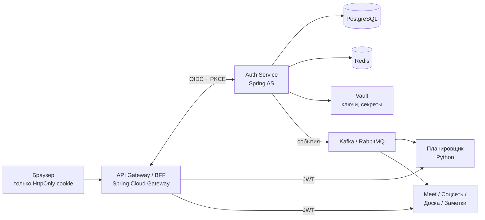
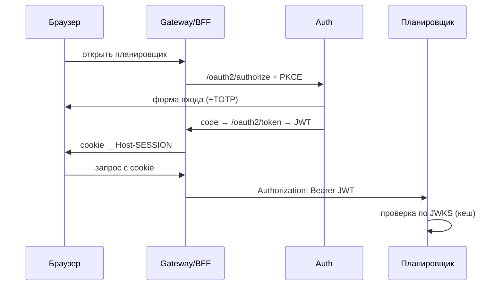

# Auth Service — архитектура SSO для экосистемы колледжа

Sep 24, 2026 · @EnotikF

## ★ План реализации по фазам

MVP — это минимум, с которым планировщик может запуститься на реальных студентах. Задачи идут в порядке реализации: одна задача = одна сессия в Claude Code = один PR с тестами.

### Как вайбкодить это в Claude Code

- Положи этот документ в репозиторий как `docs/auth-architecture.md` и сошлись на него из `CLAUDE.md`, чтобы Claude Code всегда видел контекст.
- Одна задача за сессию. Начинай с «сначала напиши тесты, потом код».
- Никакой самописной криптографии и своих токенов: только Spring Security / Spring Authorization Server. Если Claude Code предлагает «свой JWT-фильтр» — это красный флаг.
- Секреты только через env / `.env` в `.gitignore`, никогда в коде.
- После каждой задачи из блоков «вход», «токены», «пароли» — отдельное код-ревью на безопасность.

### Фаза 1 — MVP (к запуску планировщика)

- [ ] **0. Каркас.** Java 21, Spring Boot, Gradle, Docker Compose (PostgreSQL, Redis, Mailpit для писем), Flyway, Testcontainers, GitHub Actions (build + tests).
- [ ] **1. Схема БД.** Flyway-миграции: `users`, `password_credentials`, `totp_credentials`, `recovery_codes`, `roles`, `user_roles`, `allowed_email_domains`, `invitations`, `one_time_tokens`, `consents`, `audit_events` + стандартные таблицы Spring AS.
- [ ] **2. Ограничение по домену.** Таблица разрешённых доменов колледжа, нормализация email (lowercase, trim, без `+alias`), отказ для любых других доменов на всех входах: приглашение, импорт, смена email.
- [ ] **3. Authorization Server.** Регистрация клиентов `planner-bff` и `planner-api`, PKCE обязателен, access 10 мин, refresh 14 дней, подпись ES256, ключ из env, кастомные claims (`roles`, `email`), `/.well-known/openid-configuration` и `/oauth2/jwks`.
- [ ] **4. Вход.** Форма логина, Argon2id, rate limit (Bucket4j + Redis) по IP и по аккаунту, одинаковые ответы на ошибки, временная блокировка после 10 неудач.
- [ ] **5. Приглашения.** Админ загружает CSV группы → приглашения на почту → ссылка → установка пароля + согласие на обработку ПДн → аккаунт `ACTIVE`, email подтверждён.
- [ ] **6. Сброс пароля.** Одноразовый токен (хранится хеш), живёт 30 мин, после сброса отзываются все сессии.
- [ ] **7. Refresh-токены.** Ротация при каждом обновлении + reuse detection (повторное использование → отзыв всей семьи).
- [ ] **8. TOTP.** Обязателен для `ADMIN` и `CURATOR`, опционален для студентов, плюс recovery-коды.
- [ ] **9. Admin API (минимум).** Список пользователей, блокировка, выдача/снятие ролей, приглашения, сброс MFA.
- [ ] **10. /me.** Профиль, смена пароля, список сессий, выход из одной или всех.
- [ ] **11. Audit log.** Запись всех событий безопасности: вход, ошибка входа, смена роли, блокировка, сброс пароля/MFA.
- [ ] **12. Gateway / BFF.** Spring Cloud Gateway: `oauth2Login` + TokenRelay, cookie `__Host-SESSION` (`Secure; HttpOnly; SameSite=Lax`), CSRF.
- [ ] **13. Контракт для Python.** Описание claims, пример проверки JWT на Python (Authlib/PyJWT), тестовый токен для локальной разработки планировщика.
- [ ] **14. Тесты безопасности.** Интеграционные тесты: чужой домен, подбор пароля, просроченный/чужой `aud` токен, повтор refresh-токена, CSRF.

**Готово, когда:** студент по приглашению на почту колледжа входит в планировщик, планировщик сам проверяет JWT, админ может заблокировать пользователя, и через ≤ 10 минут доступ пропадает.

### Фаза 2 — укрепление

- [ ] Passkeys / WebAuthn как основной вход.
- [ ] Экран «Мои устройства» с отзывом сессий.
- [ ] Брокер событий (Kafka или RabbitMQ): `user.blocked`, `role.changed` и др. → мгновенный разлогин во всех сервисах.
- [ ] Vault: ключи подписи, pepper, секреты клиентов; плановая ротация ключей подписи.
- [ ] Шифрование персональных полей (envelope encryption) + blind index для email.
- [ ] DPoP и PAR.
- [ ] Introspection для чувствительных операций (админка, удаление данных).
- [ ] Наблюдаемость: Prometheus + Grafana, структурированные логи без персональных данных.

### Фаза 3 — под новые сервисы (meet, соцсеть, доска, заметки)

- [ ] Шаблон подключения нового сервиса: регистрация клиента, scopes, `aud`, подписка на события.
- [ ] Детальные права через ReBAC (OpenFGA): доски, заметки, методички, комнаты meet.
- [ ] Step-up аутентификация для опасных действий.
- [ ] mTLS между сервисами (service mesh), Kubernetes + HPA.
- [ ] Реплики PostgreSQL на чтение, Redis Cluster.
- [ ] Аудит по OWASP ASVS уровень 2 перед выходом на весь колледж.

## 1. Требования и допущения

Auth Service — единый OpenID-провайдер колледжа: один аккаунт на планировщик, meet, соцсеть, доску и заметки, вход только с почты на домене колледжа.

**Функциональные требования**

- SSO: один вход — доступ ко всем сервисам экосистемы.
- Вход только по email из списка разрешённых доменов колледжа. Внешних провайдеров (VK ID, Яндекс ID и т.п.) нет.
- Аккаунт появляется только по приглашению админа (импорт CSV группы). Доменная почта — необходимое, но не достаточное условие: выпускники и служебные ящики тоже имеют такую почту.
- MFA (TOTP, позже passkeys), роли, управление сессиями, админка, доступ сервисов друг к другу.

**Нефункциональные требования**

| Параметр | Цель |
| --- | --- |
| Пользователи | 1–10 тыс., архитектура без переделки до 100 тыс.+ |
| Пик нагрузки | утро перед парами, сотни входов в минуту |
| Задержка `/oauth2/token` | p95 < 300 мс (основное время — Argon2id) |
| Доступность | 99,5% в учебное время; уже выданные токены работают, даже если Auth лежит |
| Безопасность | ориентир OWASP ASVS уровень 2, 152-ФЗ |

По трафику это не хайлоад. Масштабируемость закладывается архитектурой: сервис stateless, сервисы проверяют JWT локально и не ходят в Auth на каждый запрос.

**Ограничения:** команда студентов; Auth пишется на Java, планировщик параллельно на Python, поэтому протокол должен быть языконезависимым стандартом.

## 2. Общая схема

Стандарт — OAuth 2.1 + OpenID Connect на Spring Authorization Server; браузер видит только cookie, сервисы проверяют JWT сами.



Сервисы берут публичные ключи из `/oauth2/jwks` и проверяют токены без обращения к Auth; события сообщают им о блокировках и смене ролей.

**Ключевые решения**

| Решение | Почему | Цена |
| --- | --- | --- |
| OAuth 2.1 + OIDC на Spring Authorization Server | Стандарт, готовые клиенты для Python (Authlib), свою криптографию не пишем | Высокий порог входа в Spring AS |
| Authorization Code + PKCE для всех пользовательских клиентов | Единственный рекомендуемый flow в OAuth 2.1 | Нужен редирект на страницу логина |
| BFF: токены на сервере, в браузере только cookie | XSS не может украсть токен | Лишний компонент (Gateway) |
| Client Credentials для сервис-сервис | У каждого сервиса своя учётка и scopes | Управление секретами |
| Access JWT 10 мин + непрозрачный refresh с ротацией | Проверка без запроса к Auth + быстрый отзыв | До 10 мин доступа после блокировки (решается событиями) |
| Свой Auth вместо Keycloak | Учебный и портфолио-проект, полный контроль | Больше кода и ответственности; Keycloak можно использовать как временную заглушку |

## 3. Методы защиты

Защита строится слоями: строгий вход, короткие токены, зашифрованные данные и права, которые каждый сервис проверяет сам.

### Аутентификация

- Только доменная почта колледжа: allowlist доменов в БД, нормализация email, подтверждение владения ящиком через ссылку из письма.
- Регистрация только по приглашениям (импорт CSV группы) — нет открытой формы, нет фейковых аккаунтов.
- Пароли: **Argon2id** (`Argon2PasswordEncoder`) + pepper, который хранится вне БД. Правила по NIST 800-63B: от 12 символов, без требований к составу, проверка по списку утёкших паролей.
- MFA: **TOTP** + recovery-коды в MVP; **passkeys / WebAuthn** в фазе 2. Обязательна для `ADMIN` и `CURATOR`.

### Защита от атак

- Rate limiting (Bucket4j + Redis) по IP и по аккаунту, прогрессивная задержка, капча после N неудач.
- Нет перебора пользователей: одинаковый текст и время ответа для «нет такого email» и «неверный пароль», в том числе на сбросе пароля.
- Cookie `__Host-` с `Secure; HttpOnly; SameSite=Lax`, CSRF-токены, строгий CSP и `frame-ancestors 'none'` на страницах логина.
- Refresh-токены с ротацией и reuse detection.
- Фаза 2: **DPoP** — токен привязан к ключу клиента, украденный токен бесполезен.

### Токены и ключи

- Подпись **ES256**, публичные ключи в `/oauth2/jwks` с `kid`, плановая ротация (старый ключ ещё висит в JWKS до истечения токенов).
- Приватные ключи — в env (MVP), затем в **Vault**. Никогда в git или открыто в БД.
- Каждый сервис проверяет подпись, `iss`, `exp` и **свой** `aud`: токен планировщика не принимается соцсетью.

### Данные

- TLS 1.3 на всех соединениях, mTLS между сервисами в фазе 3.
- Шифрование персональных полей (envelope encryption через Vault Transit), поиск по email через blind index (HMAC).
- Минимизация: в Auth только данные для входа и ФИО. Аватары, «о себе» и пр. живут в соцсети.
- **152-ФЗ:** согласие на обработку ПДн с версией документа, хранение в РФ, журнал доступа. Среди студентов будут несовершеннолетние — юридические детали нужно согласовать с администрацией колледжа.
- Audit log только на дозапись; в обычных логах нет паролей, токенов и полных email.

### Авторизация

- Auth выдаёт **личность + крупные роли + scopes** (`planner.read`, `notes.write`).
- Детальные права (кто редактирует эту доску или методичку) — в самих сервисах, в фазе 3 — через OpenFGA. В JWT их не кладём: токен раздувается и устаревает.

## 4. Сущности (PostgreSQL)

Ключи — UUIDv7; все секреты и токены хранятся только в виде хешей или зашифрованными.

| Таблица | Ключевые поля | Фаза |
| --- | --- | --- |
| `users` | id, email (зашифр.), email\_hash, full\_name, email\_verified, status (`INVITED/ACTIVE/LOCKED/BLOCKED/DELETED`), created\_at, last\_login\_at | 1 |
| `allowed_email_domains` | domain, active, added\_by, created\_at | 1 |
| `password_credentials` | user\_id, hash (Argon2id), changed\_at, must\_change | 1 |
| `totp_credentials` | user\_id, secret (зашифр.), confirmed\_at | 1 |
| `recovery_codes` | user\_id, code\_hash, used\_at | 1 |
| `webauthn_credentials` | user\_id, credential\_id, public\_key, sign\_count, transports, name, last\_used\_at | 2 |
| `roles` | `STUDENT / CURATOR / TEACHER / ADMIN / SUPERADMIN` | 1 |
| `permissions`, `role_permissions` | код права, связь с ролью | 1 |
| `user_roles` | user\_id, role\_id, service\_id (null = глобальная), granted\_by, expires\_at | 1 |
| `oauth2_registered_client` | сервисы-клиенты: redirect\_uri, scopes, auth method (схема Spring AS) | 1 |
| `oauth2_authorization` | выданные токены и семьи refresh (схема Spring AS) | 1 |
| `oauth2_authorization_consent` | согласия на scopes (схема Spring AS) | 1 |
| `user_sessions` | user\_id, device/UA, IP, created\_at, last\_seen, revoked\_at (горячие данные — Redis) | 1 |
| `invitations` | email, preset role, invited\_by, expires\_at, accepted\_at | 1 |
| `one_time_tokens` | token\_hash, purpose (`INVITE / EMAIL_VERIFY / PASSWORD_RESET`), user\_id, expires\_at, used\_at | 1 |
| `consents` | user\_id, doc\_type, doc\_version, accepted\_at, ip | 1 |
| `audit_events` | actor\_id, action, target, ip, result, metadata (jsonb), created\_at — только дозапись | 1 |
| `signing_keys` | kid, alg, status (`ACTIVE / RETIRING / REVOKED`), ссылка на ключ в Vault | 2 |

Попытки входа — счётчики в Redis. Учебные группы и закрепление кураторов — домен планировщика, а не Auth: в Auth только роль `CURATOR`.

## 5. Ручки API

Стандартные OIDC-эндпоинты даёт Spring AS; самим писать нужно вход, приглашения, `/me`, админку и internal API.

**Стандарт OIDC (из коробки)**

```
GET  /.well-known/openid-configuration
GET  /oauth2/jwks
GET  /oauth2/authorize
POST /oauth2/token
POST /oauth2/revoke
POST /oauth2/introspect        # для чувствительных операций
GET  /userinfo
GET  /connect/logout           # выход из всех сервисов
POST /oauth2/par               # фаза 2
```

**Вход, приглашения, восстановление**

```
GET/POST /login                           # только email разрешённых доменов
POST /login/mfa/totp
POST /login/webauthn/options              # фаза 2
POST /login/webauthn                      # фаза 2
GET  /api/v1/invitations/{token}          # проверить приглашение
POST /api/v1/invitations/{token}/accept   # пароль + согласие на ПДн
POST /api/v1/email/verify
POST /api/v1/password/forgot
POST /api/v1/password/reset
```

**Личный кабинет `/api/v1/me`**

```
GET    /me                 PATCH /me
POST   /me/password
GET    /me/mfa
POST   /me/mfa/totp/setup   POST /me/mfa/totp/confirm   DELETE /me/mfa/totp
POST   /me/passkeys/options POST /me/passkeys  GET /me/passkeys  DELETE /me/passkeys/{id}   # фаза 2
POST   /me/recovery-codes
GET    /me/sessions   DELETE /me/sessions/{id}   DELETE /me/sessions   # выйти везде
GET    /me/security-events
```

**Админка `/api/v1/admin`** — только `ADMIN` + MFA

```
GET/POST   /admin/users          GET/PATCH /admin/users/{id}
POST       /admin/users/import                 # CSV группы → приглашения
POST       /admin/invitations    DELETE /admin/invitations/{id}
PATCH      /admin/users/{id}/status            # блокировка
POST       /admin/users/{id}/roles   DELETE /admin/users/{id}/roles/{roleId}
POST       /admin/users/{id}/sessions/revoke
POST       /admin/users/{id}/mfa/reset
GET/POST   /admin/domains        DELETE /admin/domains/{domain}   # разрешённые домены
GET        /admin/audit
CRUD       /admin/clients        POST /admin/clients/{id}/secret/rotate
POST       /admin/keys/rotate                  # фаза 2
```

**Между сервисами** (client\_credentials, scope `users.read`)

```
GET  /internal/v1/users/{id}
POST /internal/v1/users:batch      # ФИО по списку id
```

**События (фаза 2):** `user.created`, `user.updated`, `user.blocked`, `user.deleted`, `role.granted`, `role.revoked`, `session.revoked`.

## 6. Интеграция Python-планировщика

Планировщик не хранит пароли и не делает логин — он только проверяет JWT. Контракт фиксируем сейчас, чтобы Java и Python шли параллельно.



1. Регистрируем планировщик как клиента (`aud=planner`, scopes `planner.*`).
2. На каждый запрос FastAPI/Django проверяет подпись по JWKS (Authlib/PyJWT, кеш ключей), `iss`, `aud`, `exp`.
3. Из токена берёт `sub` (id пользователя) и `roles`; группы и кураторство хранит у себя по `sub`.
4. ФИО по списку id — через `POST /internal/v1/users:batch`; с фазы 2 — подписка на `user.blocked` и `user.updated`.

Пока Auth не готов, Python-команда может работать против Keycloak в Docker: протокол тот же, потом меняется только `issuer`.

## 7. Что пересмотреть при росте и открытые вопросы

**При росте:** хранение сессий (Redis Cluster), реплики PostgreSQL на чтение, вынос профиля в отдельный сервис, выбор между Kafka и RabbitMQ под реальный поток событий.

**Открытые вопросы**

- [ ] Какие именно домены почты у колледжа (студенты и преподаватели на одном или разных)?
- [ ] Где живёт почта колледжа (свой сервер, Яндекс 360, Google Workspace) и можно ли отправлять письма на неё без спам-фильтров?
- [ ] Кто и как генерирует CSV со списками групп и что делать с выпускниками и отчисленными?
- [ ] Где хостится система (сервер колледжа или облако в РФ) — это влияет на 152-ФЗ и Vault.
